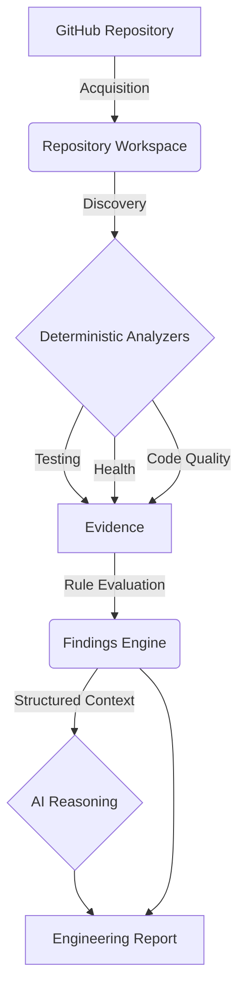
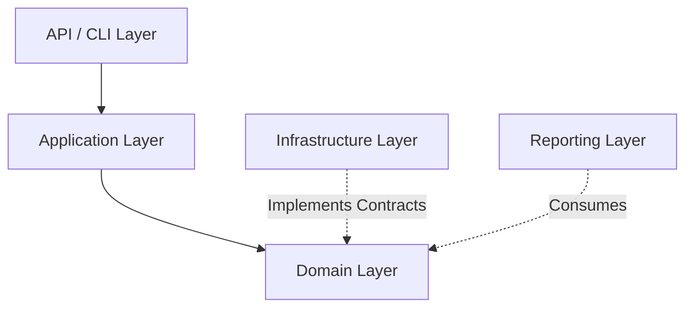

# RepoLens AI

**AI-Powered GitHub Repository Intelligence & Engineering Health Platform**

> Understand. Analyze. Improve.

---

## Overview

RepoLens AI is a platform designed to automatically evaluate the engineering health of GitHub repositories. It retrieves repository data into a secure workspace, applies deterministic analysis to gather structured evidence, and uses artificial intelligence to interpret that evidence and generate professional engineering reports.

## Problem

Understanding the quality, structure, and health of an unfamiliar codebase is time-consuming. Engineers and reviewers often spend hours manually searching for tests, evaluating code quality, tracking down dependencies, and reviewing architecture before they can contribute or make architectural decisions.

While AI models can analyze code, they are prone to hallucinations—often inventing files, test coverage metrics, or vulnerabilities that do not exist, making raw AI output untrustworthy for rigorous engineering reviews.

## Solution

RepoLens AI solves this by executing a deterministic analysis pipeline *before* invoking AI. The platform relies on deterministic, rule-based evidence collection to generate objective Findings. Only after this evidence is assembled is it passed to an AI reasoning layer, which is strictly instructed to interpret the provided facts and supply an executive summary, strengths, concerns, and recommendations.

## Core Principle

### Evidence First, AI-Assisted

Deterministic analyzers produce objective, measurable evidence (e.g., "The repository contains `pytest` configuration but no test files").

AI interprets and explains that evidence—but must **never** invent metrics, test results, or facts that are not present in the structured evidence. The AI acts as an advisory reasoning layer over deterministic, rule-based evidence, ensuring high credibility and trustworthy reports.

---

## How It Works



---

## Architecture

RepoLens AI is designed as a **Modular Monolith** with strict separation of concerns, enforcing unidirectional dependency flow.



## Layer Responsibilities

- **API Layer**: Thin HTTP handlers (FastAPI) routing requests and serializing responses.
- **Application Layer**: Orchestrates use-cases, pipelines, and transactions (e.g., `AnalysisService`). Contains no framework-specific logic.
- **Domain Layer**: Core business models, interfaces (`AIProvider`, `Analyzer`, `FindingRule`), and pure logic. Depends on nothing else.
- **Infrastructure Layer**: Technical implementations of Domain contracts (e.g., GitHub interactions, SQLite persistence, Google/OpenRouter API integration).
- **Reporting Layer**: Generates output artifacts (HTML, JSON, Markdown) from Domain results.

---

## Analyzer System

Analyzers are strictly responsible for returning objective `ObservedFact` or `MeasuredMetric` evidence.

### Implemented Analyzers
- **Repository Health Analyzer**: Extracts base repository metrics (total files, size) and metadata.
- **Testing Intelligence Analyzer**: Detects the presence of testing frameworks (`pytest`, `unittest`), test directories, and test configuration files.
- **Code Quality Analyzer**: Identifies code quality tooling (`black`, `ruff`, `mypy`, `flake8`) and language distributions.

*(Note: Analyzers for Architecture, Dependencies, Git Health, and Security Hygiene are planned on the roadmap).*

## Findings Engine

The Findings Engine processes `Evidence` through a protocol of pure, deterministic `FindingRule` functions.

- **Finding Model**: Findings are normalized objects with a deterministic `finding_id` derived from the rule and the evidence keys.
- **Categories**: Findings are grouped into categories such as `testing`, `code_quality`, `repository`, etc.
- **Severity**: Explainable severity levels ranging from `INFO` to `CRITICAL`.

---

## AI Architecture

RepoLens AI employs a provider-agnostic protocol for AI reviews.

```text
AIProvider (Domain)
├── GoogleAIProvider (Infrastructure)
└── OpenRouterAIProvider (Infrastructure)
```

- **AIContext / AIContextBuilder**: Token-minimized context objects that summarize repository facts instead of dumping raw code.
- **AIReview / AIAdvisor**: Structured interpretation, strengths, concerns, and recommendations.
- **Provider Selection**: Deterministic factory logic that instantiates the active provider based on environment configuration. Provider-specific logic and SDK usage are strictly confined to the Infrastructure layer.

## AI Safety

The platform employs a rigorous safety model:
- **Untrusted Data**: Repository text and structure are explicitly treated as untrusted data, separated from instructions via delimiters to mitigate prompt injection.
- **Minimized Context**: Code is not indiscriminately sent to the AI.
- **Structured Output Validation**: Structured JSON parsing and validation into the AIReview model.
- **Bounded Responses**: OpenRouter implementation caps the response stream size to prevent OOM/Denial of Service attacks.
- **Secret Protection**: API keys are not persisted and are stripped from logs and string representations.

---

## Reports

RepoLens AI supports three output formats:
- **HTML**: Embedded CSS, severity badges, structured evidence visualization, and AI review rendering. Suitable for browser viewing.
- **JSON**: Machine-readable analysis snapshot.
- **Markdown**: Lightweight, formatted text reports.

## API / Dashboard

Built with FastAPI, exposing the following endpoints:
- `GET /api/v1/health`: Basic API health check.
- `POST /api/v1/analyses`: Trigger a new repository analysis.
- `GET /api/v1/analyses`: List recent analyses.
- `GET /api/v1/analyses/{id}`: Retrieve analysis details.
- `GET /api/v1/analyses/{id}/findings`: Retrieve detailed findings.
- `GET /api/v1/analyses/{id}/report`: Render reports in specific formats.

The system also includes a Jinja2-based Web Dashboard accessible at the root (`/`) to visualize analysis status and view HTML reports.

## Persistence

Data is persisted locally in SQLite (`repolens.db`) using SQLAlchemy ORM. The `SQLiteAnalysisStore` fulfills the `AnalysisStore` domain contract.

---

## Technology Stack

- **Python**: >= 3.12
- **Web Framework**: FastAPI & Uvicorn
- **Persistence**: SQLAlchemy & SQLite
- **AI Integration**: `google-genai` and `httpx` (OpenRouter)
- **Reporting**: Jinja2 (HTML generation)
- **Testing**: `pytest`
- **Linting & Formatting**: `ruff`

## Project Structure

```text
RepoLens-AI/
├── pyproject.toml             # Dependencies & config
├── README.md                  # Project overview
├── PROJECT_STATUS.md          # Current implementation status
├── src/
│   └── repolens/
│       ├── api/               # FastAPI endpoints & middleware
│       ├── application/       # Orchestration (AnalysisService)
│       ├── domain/            # Core models (Evidence, Finding, AIProvider)
│       ├── infrastructure/    # Implementations (GitHub, AI, DB)
│       ├── analyzers/         # Deterministic analyzers
│       ├── reports/           # HTML, JSON, Markdown generators
│       └── cli/               # Command-line interface
└── tests/
    └── unit/                  # Extensive test suite
```

---

## Configuration

RepoLens AI is configured via environment variables. Create a `.env` file at the repository root.

```ini
# AI Provider Selection ('google' or 'openrouter')
REPOLENS_AI_PROVIDER=openrouter

# AI Provider Credentials
OPENROUTER_API_KEY=your_openrouter_api_key_here
REPOLENS_AI_API_KEY=your_google_gemini_api_key_here

# (Optional) Model Overrides
REPOLENS_AI_MODEL=openrouter/free
```

> **WARNING**: Never commit API keys to version control. Use `.env` or secure secret management.

---

## Installation

```powershell
# Clone the repository
git clone https://github.com/Mazenalodini/RepoLens-AI.git
cd RepoLens-AI

# Create virtual environment
python -m venv .venv

# Activate virtual environment (Windows PowerShell)
.\.venv\Scripts\Activate.ps1

# Install in development mode
pip install -e ".[dev]"
```

## Running the Application

To start the API and web dashboard:

```powershell
# Run the FastAPI server
uvicorn repolens.api.app:create_app --factory --reload
```
Access the dashboard at `http://127.0.0.1:8000`.

---

## Testing

The project maintains a comprehensive test suite covering domain logic, path traversal safety, AI integrations, and API routes.

```powershell
pytest tests/ -v
```
*(Currently validates 361 tests).*

## Code Quality

RepoLens AI strictly enforces static analysis, typing, and formatting using Ruff.

```powershell
ruff check .
```

## Security Considerations

- **Untrusted Repositories**: Analyzed repositories are strictly bounded to read-only temporary workspaces without execution capabilities. Path traversal protections are in place.
- **AI Responses**: Treated as potentially malformed or explicitly hostile.
- **Payload Limits**: API employs RequestSizeLimitMiddleware to reject large inputs.

---

## Project Status

**Initial Functional Version / Active Development**

The core pipeline, analysis engine, findings normalization, and AI reasoning layers are fully implemented. For exact details, see [`PROJECT_STATUS.md`](PROJECT_STATUS.md).

## Roadmap

### Implemented
- Core Domain & Application orchestration.
- Safe GitHub Repository Acquisition.
- Deterministic Analyzers (Health, Testing, Code Quality).
- Findings Engine.
- AI Provider abstraction (Google Gemini & OpenRouter).
- HTML, JSON, and Markdown Report Generators.
- FastAPI Dashboard & Routes.

### Next Development
- Architecture Analyzer.
- Dependency Analyzer.
- Security Hygiene Analyzer.
- Git Health Analyzer.

### Future Development
- CI/CD Pipelines Integration.
- GitHub PR Comments & App Delivery.
- Extended AI pattern correlation.

---

## Development Approach

RepoLens AI is built using a rigorous, iteratively developed **Documentation-Driven Workflow**. It adheres to evidence-driven engineering, focusing heavily on modular architecture and automated testing. All major structural enhancements require prior architectural design and human review.

For operating guidelines, please see [`AGENTS.md`](AGENTS.md).
